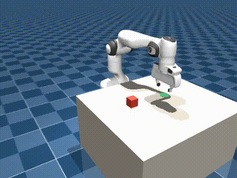

# benchtop

Reproducible evaluation for robot manipulation policies, in simulation.

Bring a policy checkpoint, get a scorecard: success rate with a confidence
interval, per-episode records, and rollout videos — against a versioned task
on held-out seeds.

**Status: v0.** The full loop below — collect, train, eval, dash — runs end
to end on CPU. The plan of record is
[`.devin/plans/benchtop-v0.md`](.devin/plans/benchtop-v0.md).



## Why

Training robot policies has good tooling. Knowing whether a policy actually
got better does not. Results get reported on seeds that were trained on, on
task variants that quietly changed between runs, with a success rate quoted
to three digits off twenty episodes.

benchtop treats the evaluation itself as the artifact: tasks are versioned and
immutable, evaluation seeds are held out from collection seeds by protocol,
every run records the git sha and resolved config that produced it, and
success rates come with Wilson intervals so you can see when a difference
isn't one.

## Quickstart

```bash
uv sync --all-extras

# 1. Scripted expert -> demonstration dataset (seeds 0-99, ~2 min)
uv run benchtop collect --episodes 100 --out datasets/pick_cube_v0_expert

# 2. Train state-only ACT on those demos (CPU; ~4.5 h at batch 64 / 30k steps)
uv run benchtop train --dataset datasets/pick_cube_v0_expert \
    --out outputs/train/act_pick_cube_v0

# 3. Evaluate on the held-out suite (seeds 10000+, never trained on)
uv run benchtop eval --suite suites/pick_cube_v0.yaml \
    --policy lerobot:outputs/train/act_pick_cube_v0/checkpoints/last/pretrained_model
uv run benchtop eval --policy expert
uv run benchtop eval --policy random

# 4. Browse and compare runs in the local dashboard
uv run benchtop dash --runs-dir runs
```

Or skip training: download the trained checkpoint from the
[GitHub release](https://github.com/jishnusenthilkumar5-cyber/benchtop/releases),
unpack it, and pass the directory as `--policy lerobot:<path>`.

## v0 results

Measured on the held-out suite (`suites/pick_cube_v0.yaml`: 100 episodes,
seeds 10000–10099; collection/training used seeds 0–99). Success rates carry
95% Wilson intervals.

| Policy | Success | 95% CI | Lift rate | Median steps to success |
|---|---|---|---|---|
| ACT (state-only, 30k steps, CPU) | **95/100 = 95%** | [88.8%, 97.8%] | 100% | 132 |
| Scripted expert | 97/100 = 97% | [91.5%, 99.0%] | 100% | 131 |
| Random | 0/100 = 0% | [0.0%, 3.7%] | 3% | — |

Training detail: 98/100 expert demos kept (2 expert failures dropped),
LeRobot ACT with `observation.state` + `observation.environment_state`
(no camera input), batch 64, 30k steps, ~4.5 h on an 8-core CPU VM. A
mid-training checkpoint at 15k steps scored 93% [86.3%, 96.6%]; the final
30k checkpoint is the released one.

## v0 scope

One task — `pick_cube-v0`, a Franka Panda picking a cube and placing it in a
target zone — evaluated end to end with a genuinely learned checkpoint rather
than a scripted stand-in. Policies are state-based in v0 (proprioception plus
object poses, no camera input), which is what makes training tractable on CPU;
cameras are still rendered for rollout video. Image-based policies come after.

## Requirements

Python ≥ 3.12 and [uv](https://docs.astral.sh/uv/). MuJoCo runs on CPU — no
GPU required for anything in v0.

```bash
uv sync --all-extras
uv run pytest
```

## Third-party

The Franka Panda model is vendored from
[mujoco_menagerie](https://github.com/google-deepmind/mujoco_menagerie)
under BSD-3-Clause. See [`vendor/VENDORING.md`](vendor/VENDORING.md).
